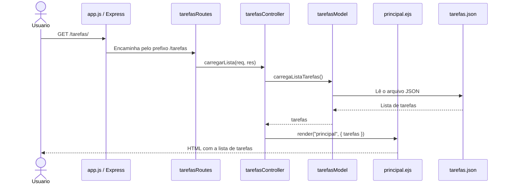
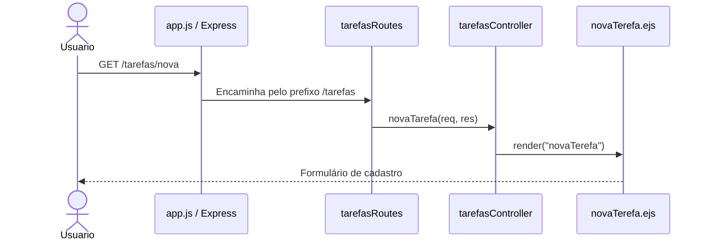
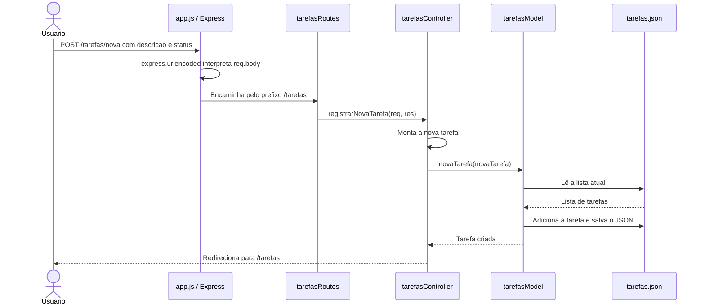
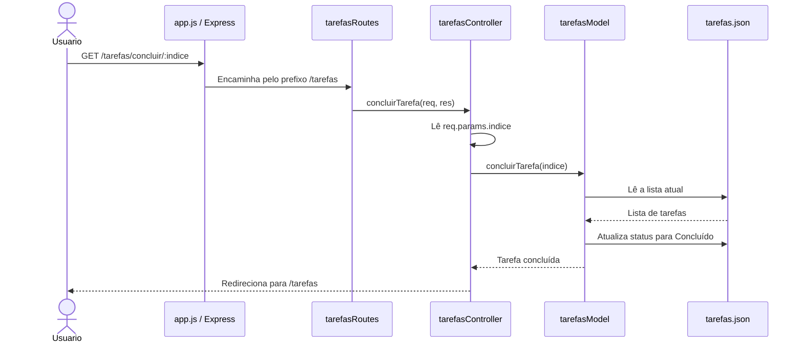
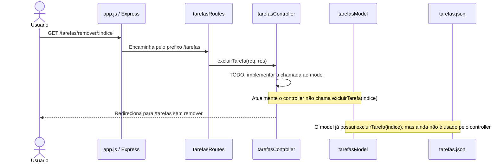

# Lista de tarefas: arquitetura MVC

Este diretório implementa uma aplicação simples de lista de tarefas usando
Node.js, Express e EJS. A organização segue o padrão **MVC** (Model, View,
Controller), com o fluxo principal:

```text
app.js -> routes -> controllers + models -> views
```

## Como o MVC está aplicado

### Aplicação: `app.js`

É o ponto de entrada da aplicação. Ele:

- cria a aplicação Express;
- configura o EJS como mecanismo de views;
- habilita o recebimento de dados de formulários com `express.urlencoded`;
- registra as rotas de tarefas no prefixo `/tarefas`;
- inicia o servidor na porta `8080`.

### Rotas: `routes/tarefasRoutes.js`

As rotas recebem as requisições HTTP e encaminham cada uma para a função
correspondente no controller:

| Método | URL                         | Controller            | Ação                             |
| ------ | --------------------------- | --------------------- | -------------------------------- |
| `GET`  | `/tarefas/`                 | `carregarLista`       | Exibe todas as tarefas           |
| `GET`  | `/tarefas/nova`             | `novaTarefa`          | Exibe o formulário               |
| `POST` | `/tarefas/nova`             | `registrarNovaTarefa` | Cadastra uma tarefa              |
| `GET`  | `/tarefas/concluir/:indice` | `concluirTarefa`      | Marca uma tarefa como concluída  |
| `GET`  | `/tarefas/remover/:indice`  | `excluirTarefa`       | Solicita a remoção de uma tarefa |

### Controllers: `controllers/tarefasController.js`

Os controllers coordenam o fluxo da aplicação. Eles recebem `req` e `res`,
leem parâmetros ou dados do formulário, chamam o model e escolhem a resposta:

- renderizar uma view com `res.render(...)`;
- redirecionar para `/tarefas` após uma alteração;
- retornar o status HTTP correspondente.

O controller não manipula diretamente o arquivo JSON. Essa responsabilidade
fica no model.

### Models: `models/tarefasModel.js`

O model contém as regras de acesso e alteração dos dados. As tarefas são
armazenadas em `models/tarefas.json`, usando o módulo `fs` do Node.js.

- `carregaListaTarefas`: lê e converte o JSON em uma lista;
- `salvarListaTarefas`: grava a lista no arquivo JSON;
- `novaTarefa`: adiciona uma tarefa e salva a lista;
- `concluirTarefa`: altera o status da tarefa para `Concluído`;
- `excluirTarefa`: remove uma tarefa pelo índice e salva a lista.

### Views: `views/`

As views são templates EJS responsáveis pela apresentação HTML:

- `principal.ejs` percorre `tarefas`, mostra descrição e status e exibe as
  opções disponíveis;
- `novaTerefa.ejs` exibe o formulário de cadastro, enviando `descricao` e o
  status inicial `Pendente`.

## Diagramas de sequência

Os diagramas abaixo mostram a comunicação entre navegador, aplicação, rota,
controller, model e view em cada ação disponível.

### 1. Listar tarefas



### 2. Abrir o formulário de nova tarefa



### 3. Cadastrar nova tarefa



### 4. Concluir tarefa



### 5. Remover tarefa



Para concluir a implementação dessa ação, o controller deverá obter o índice
em `req.params.indice`, chamar `tarefasModel.excluirTarefa(indice)` e então
redirecionar para `/tarefas`, como já está previsto na rota e no model.
